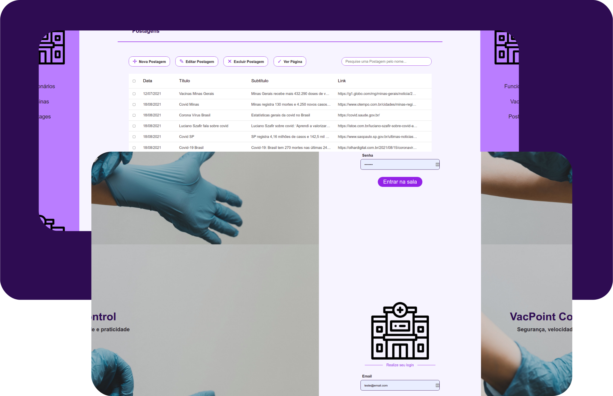

# VacPoint_Control


[](https://github.com/GabrielFSSantos/VacPoint_Control/blob/main/LICENSE)

<h1  align="center">
	
</h1>

> :wrench: Projeto criado para estudar e praticar conhecimentos de programação e para fins didáticos. <br><br>

> :books: VacPoint_Control vai lhe ajudar a gerenciar as vacinas de seus funcionários de forma rápida e objetiva. O sistema conta com recursos de gerenciamento dos funcionários, gerenciamento das vacinas dos mesmos e a suas doses e o gerenciamento de uma página de noticias, onde pode anexar cards de redirecionamento para sites ou recursos relacionados.<br><br>

## Requirements
>Ter instalado pelo menos um gerenciador de pacotes do Node, [Npm](https://www.npmjs.com/) ou [Yarn](https://yarnpkg.com/).
>Ter instalado banco de dados MongoDB ou utilização do mesmo pelo MongoDB Atlas que permite a utilização online, após o mesmo criar um arquivo <b>.env</b> na pasta backend do projeto com as seguintes informações do banco:
```sh
PORT=<Porta onde o backend irá funcionar, sugestão: 3333>
DB_HOST=<Host do banco de dados para acesso ao mesmo>
```

## Installing
>Executar na raiz do projeto o seguinte comando para instalar as dependências:
```sh
cd ./backend
```
```sh
yarn install	   ou		npm install
```
>E logo após voltar a pasta raiz do projeto e executar:
```sh
cd ./frontend
```
```sh
yarn install	   ou		npm install
```

## Use <a  name="usage"></a>
>Executar na raiz do projeto o seguinte comando para iniciar o projeto:
```sh
cd ./backend
```
```sh
yarn dev:server	   ou		npm dev:server
```
>E logo após voltar a pasta raiz do projeto e executar:
```sh
cd ./frontend
```
```sh
yarn start	   ou		npm start
```

## Contributing

> :information_desk_person: O projeto é de livre acesso e uso, então fique à-vontade para realizar um Fork e utilizar do mesmo, como também sugerir dicas e melhorias.

>

> 1. Faça um **fork** do projeto.

> 2. Crie uma nova branch com as suas alterações: `git checkout -b my-feature`

> 3. Salve as alterações e crie uma mensagem de commit contando o que você fez: `git commit -m "feature: My new feature"`

> 4. Envie as suas alterações: `git push origin my-feature`

> Caso tenha alguma dúvida confira este [guia de como contribuir no GitHub](https://github.com/firstcontributions/first-contributions)

## Tech
> :space_invader: Softwares e tecnologias utilizadas para o desenvolvimento e uso do projeto:
>
* [React] - Ferramenta utilizada para o desenvolvimento front-end.
* [Node.js] - Ferramenta base utilizada para o desenvolvimento geral.
* [Typescript] - Ferramenta de tipagem utilizada para o desenvolvimento geral.
* [MongoDB] - Banco de dados utilizado para registro de informações do mesmo.
* [VSCode] - Ótimo editor de texto.
* [StackEdit] - Excelente editor de Markdown online.

## License
[MIT License](https://github.com/GabrielFSSantos/Basic_Laundry_System/blob/master/LICENSE)

[React]: <https://reactjs.org>
[Node.js]: <https://nodejs.org/>
[Typescript]: <https://www.typescriptlang.org/>
[VSCode]: <https://code.visualstudio.com/>
[StackEdit]: <https://stackedit.io/>
[MongoDB]:<https://www.mongodb.com/pt-br>